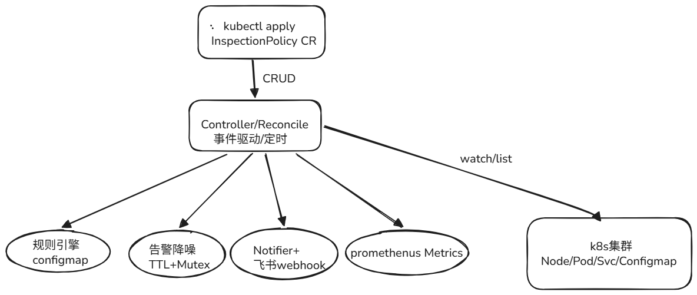

# K8s-Inspection-Operator

K8s 集群资源巡检 Operator | Go + Kubebuilder + CRD | 声明式巡检策略 + ConfigMap 规则热更新 + 飞书告警 + Prometheus 自监控

---

## 项目简介

K8s-Inspection-Operator 是一个基于 Kubernetes Operator 的集群状态巡检组件。
作为 Prometheus 的补充，它检测 K8s 资源对象 **Spec/Status 层的隐性异常**
（如 Pod 频繁重启、Node 未就绪、镜像拉取失败等），这些异常无法通过
Prometheus 时序指标捕获。

项目通过自定义资源（`InspectionPolicy` CR）实现**声明式巡检策略管理**，
支持 **ConfigMap 规则热更新**、**插件化告警后端**、**TTL 告警降噪** 和
**Prometheus 自监控**。架构高度可扩展，便于接入多种规则类型和通知渠道。

---

## 项目架构

### 系统架构图


### 核心模块

K8s-Inspection-Operator 项目由以下六个核心模块组成：

- **CRD（InspectionPolicy）**

  自定义资源定义，声明式配置巡检策略。Spec 包含巡检范围
  （`targetNamespaces`）、规则来源（`rulesConfigMap`）、巡检周期
  （`intervalSeconds`）、告警冷却时间（`alertCooldown`）、告警后端
  （`notifierWebhook`）；Status 记录最近巡检时间、累计巡检次数、累计异常数。

- **Controller（控制器）**

  负责核心业务逻辑的调度和协调，监听 `InspectionPolicy` CR 的变化，
  触发 Reconcile 循环。采用**事件驱动 + 定时 Resync 兜底**双机制：
  资源变更时立即触发，周期到达时全量扫描。

- **RuleEngine（规则引擎）**

  从 ConfigMap 加载 YAML 规则，通过 `ParseRules` 解析为 Go 结构，
  通过 `MatchPod` 对每个 Pod 执行规则匹配。规则外置支持**热更新**，
  修改规则无需重启 Operator。

- **Notifier（通知机制）**

  面向接口编程，支持多种告警后端。已实现**飞书 Webhook** 通知，
  通过 `Notifier` 接口抽象，便于快速扩展钉钉、Slack 等渠道。

- **AlertCooldown（告警降噪）**

  基于内存 TTL 的冷却机制，相同异常在冷却期内只告警一次。使用
  `sync.Mutex` 保证并发安全。异常 key 为 `namespace/podName/ruleName`，
  每条规则独立冷却。

- **Metrics（自监控）**

  暴露 Prometheus 指标：`inspection_total`（巡检总次数）和
  `anomaly_detected_total`（按 namespace、severity 分类的异常数）。
  注册到 controller-runtime 的 registry，自动暴露在 `:8080/metrics`。

### 与项目一的可观测性联动

Operator 暴露的 Prometheus Metrics 可以被外部 Prometheus 抓取，
结合 Grafana 实现：

- **可视化**：巡检次数、异常数、按 namespace/severity 分类的趋势
- **二次告警**：当异常数突增时，Grafana 触发升级告警

这是与项目一（K8s-Cilium-SRE-Platform）的完整可观测性闭环。

---

## 项目部署

### 环境要求

- Go version v1.22+
- kubectl version v1.27+
- Access to a Kubernetes v1.27+ cluster
- Helm 3.12+
- Make

项目支持 **Helm** 和 **Make** 两种部署方式。

### 前置准备

1. 创建命名空间

```bash
kubectl create namespace inspection-system
```

2. 准备巡检规则 ConfigMap

```bash
cat > /tmp/rules.yaml <<'EOF'
rules:
- name: pod-crashloop
  resource: Pod
  condition:
    field: restartCount
    op: ">"
    value: 5
  severity: critical
  message: "Pod 频繁重启"
- name: pod-failed
  resource: Pod
  condition:
    field: phase
    op: "=="
    value: 1
  severity: critical
  message: "Pod 处于 Failed 状态"
EOF

kubectl create configmap inspection-rules \
  --from-file=rules.yaml=/tmp/rules.yaml \
  -n default
```

### Helm 部署

项目的 `helm/` 目录存放了 K8s-Inspection-Operator 的 Helm Chart，
安装前请先填写 `values.yaml`。

```yaml
# helm/inspection-operator/values.yaml
image:
  repository: crpi-d78jk9v69c8g3p1f.cn-hangzhou.personal.cr.aliyuncs.com/k3s-sre/inspection-operator
  tag: latest
  pullPolicy: IfNotPresent

replicaCount: 1

resources:
  limits:
    cpu: 500m
    memory: 256Mi
  requests:
    cpu: 100m
    memory: 128Mi
```

填写完成后，安装 Helm Chart：

```bash
helm install inspection-operator ./helm/inspection-operator \
  -n inspection-system
```

### Make 部署

**将 CRD 安装到集群中**

```bash
make install
```

**将 Manager 部署到集群中**

```bash
make deploy IMG=controller:latest
```

**创建示例 CR**

```bash
kubectl apply -k config/samples/
```

### 卸载

```bash
kubectl delete inspectionpolicy --all   # 删除 CR 实例
make uninstall                          # 删除 CRD
make undeploy                           # 删除 Controller
```

---

## 配置项说明

### InspectionPolicy Spec

| 字段 | 说明 | 必需 |
|---|---|---|
| `targetNamespaces` | 巡检哪些 namespace（数组） | 是 |
| `rulesConfigMap` | 规则所在 ConfigMap 名称 | 是 |
| `intervalSeconds` | 巡检周期（秒），最小 10 | 否，默认 60 |
| `alertCooldown` | 告警冷却时间（秒） | 否，默认 300 |
| `notifierWebhook` | 飞书 Webhook URL | 否 |

### 规则 ConfigMap

| 字段 | 说明 | 必需 |
|---|---|---|
| `name` | 规则名称 | 是 |
| `resource` | 资源类型（目前支持 Pod） | 是 |
| `condition.field` | 检测字段（restartCount / phase） | 是 |
| `condition.op` | 操作符（>、>=、==、<、<=） | 是 |
| `condition.value` | 比较值 | 是 |
| `severity` | 严重等级（critical / warning / info） | 是 |
| `message` | 告警消息 | 是 |

---

## 使用示例

### 创建一个 InspectionPolicy 资源

```yaml
apiVersion: inspection.example.com/v1alpha1
kind: InspectionPolicy
metadata:
  name: cluster-health-check
  namespace: default
spec:
  targetNamespaces:
    - default
    - kube-system
  rulesConfigMap: inspection-rules
  intervalSeconds: 30
  alertCooldown: 300
  notifierWebhook: "https://open.feishu.cn/open-apis/bot/v2/hook/xxx"
```

CR 创建成功后，Operator 会自动开始巡检并按照配置发送告警。

### 模拟异常 Pod

```bash
kubectl run crash-pod --image=registry.k8s.io/pause:3.6 --restart=Always \
  --command -- /nonexistent-command
```

等 30 秒后，Operator 日志会显示：

```
INFO  【异常】Pod 频繁重启  {"name": "crash-pod", "restartCount": 6}
INFO  飞书告警已发送  {"pod": "crash-pod"}
```

### 查看巡检指标

```bash
curl localhost:8080/metrics | grep -E "inspection_total|anomaly_detected"
```

预期输出：

```
# HELP inspection_total 集群巡检总次数
# TYPE inspection_total counter
inspection_total 15

# HELP anomaly_detected_total 检测到的异常总数
# TYPE anomaly_detected_total counter
anomaly_detected_total{namespace="default",severity="critical"} 6
```

---

## 项目局限及后续补充方向

- **单实例运行**：未实现 Leader Election，多副本会重复告警
- **内存告警冷却**：Operator 重启后冷却状态丢失
- **无 Validating Webhook**：错误规则配置可能导致异常
- **只支持飞书**：未扩展钉钉、Slack 等其他后端
- **单集群**：未做多集群管理

---

## 开发

### 本地运行

```bash
make run
```

### 构建镜像

```bash
make docker-build IMG=inspection-operator:v0.1.0
```

### 运行测试

```bash
make test
```

### 生成 CRD 和 DeepCopy 代码

```bash
make manifests
make generate
```

---

## License

Apache License 2.0

